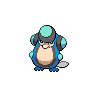
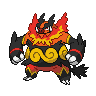

# Route 5

| Trainer            | 1                                                                                    | 2                                                                                | 3                                                                                |
| ------------------ | ------------------------------------------------------------------------------------ | -------------------------------------------------------------------------------- | -------------------------------------------------------------------------------- |
| Preschooler Sarah  |   [Lunatone](/pokemon/337)  Lv. 35     |
| Preschooler Billy  |   [Solrock](/pokemon/338)  Lv. 35       |
| Baker Jenn         |   [Combee](/pokemon/415)  Lv. 33         |
| Harlequin Paul     |   [Palpitoad](/pokemon/536)  Lv. 32   |   [Seel](/pokemon/086)  Lv. 32         |
| Musician Preston   |   [Wigglytuff](/pokemon/040)  Lv. 33 |
| Dancer Brian       |   [Kirlia](/pokemon/281)  Lv. 33         |   [Ludicolo](/pokemon/272)  Lv. 33 |
| Artist Horton      |   [Smeargle](/pokemon/235)  Lv. 31     |   [Smeargle](/pokemon/235)  Lv. 31 |   [Smeargle](/pokemon/235)  Lv. 31 |
| Backpacker Michael |   [Nosepass](/pokemon/299)  Lv. 33     |
| Backpacker Lois    |   [Shiftry](/pokemon/275)  Lv. 33       |

=== "Fire"

    | Trainer                                                                             | 1                                                                                  | 2                                                                                | 3                                                                                | 4                                                                                | 5                                                                                |
    | ----------------------------------------------------------------------------------- | ---------------------------------------------------------------------------------- | -------------------------------------------------------------------------------- | -------------------------------------------------------------------------------- | -------------------------------------------------------------------------------- | -------------------------------------------------------------------------------- |
    | Cheren   |   [Staraptor](/pokemon/398)  Lv. 36 |   [Gigalith](/pokemon/526)  Lv. 36 |   [Alakazam](/pokemon/065)  Lv. 36 |   [Simisear](/pokemon/514)  Lv. 36 |   [Samurott](/pokemon/503)  Lv. 38 |

=== "Grass"

    | Trainer                                                                             | 1                                                                                  | 2                                                                                | 3                                                                                | 4                                                                                | 5                                                                            |
    | ----------------------------------------------------------------------------------- | ---------------------------------------------------------------------------------- | -------------------------------------------------------------------------------- | -------------------------------------------------------------------------------- | -------------------------------------------------------------------------------- | ---------------------------------------------------------------------------- |
    | Cheren   |   [Staraptor](/pokemon/398)  Lv. 36 |   [Gigalith](/pokemon/526)  Lv. 36 |   [Alakazam](/pokemon/065)  Lv. 36 |   [Simisage](/pokemon/512)  Lv. 36 |   [Emboar](/pokemon/500)  Lv. 38 |

=== "Water"

    | Trainer                                                                             | 1                                                                                  | 2                                                                                | 3                                                                                | 4                                                                                | 5                                                                                  |
    | ----------------------------------------------------------------------------------- | ---------------------------------------------------------------------------------- | -------------------------------------------------------------------------------- | -------------------------------------------------------------------------------- | -------------------------------------------------------------------------------- | ---------------------------------------------------------------------------------- |
    | Cheren   |   [Staraptor](/pokemon/398)  Lv. 36 |   [Gigalith](/pokemon/526)  Lv. 36 |   [Alakazam](/pokemon/065)  Lv. 36 |   [Simipour](/pokemon/516)  Lv. 36 |   [Serperior](/pokemon/497)  Lv. 38 |

 

## Cheren

=== "Fire"

    |             | Item                                                                    | Nature | Ability      | Moves                                                     |
    | ---------------------------------------------------------------------------------- | ----------------------------------------------------------------------- | ------ | ------------ | --------------------------------------------------------- |
    |   [Staraptor](/pokemon/398)  Lv. 36 |    Sharp beak          | N/A    | Reckless     | <ul><li>N/A</li><li>N/A</li><li>N/A</li><li>N/A</li></ul> |
    |   [Gigalith](/pokemon/526)  Lv. 36   |    Hard stone          | N/A    | Sturdy       | <ul><li>N/A</li><li>N/A</li><li>N/A</li><li>N/A</li></ul> |
    |   [Alakazam](/pokemon/065)  Lv. 36   |    Twisted spoon | N/A    | Magic-Guard  | <ul><li>N/A</li><li>N/A</li><li>N/A</li><li>N/A</li></ul> |
    |   [Simisear](/pokemon/514)  Lv. 36   |    Expert belt       | N/A    | Blaze        | <ul><li>N/A</li><li>N/A</li><li>N/A</li><li>N/A</li></ul> |
    |   [Samurott](/pokemon/503)  Lv. 38   |    Sitrus berry    | N/A    | Vital-Spirit | <ul><li>N/A</li><li>N/A</li><li>N/A</li><li>N/A</li></ul> |

=== "Grass"

    |             | Item                                                                    | Nature | Ability      | Moves                                                     |
    | ---------------------------------------------------------------------------------- | ----------------------------------------------------------------------- | ------ | ------------ | --------------------------------------------------------- |
    |   [Staraptor](/pokemon/398)  Lv. 36 |    Sharp beak          | N/A    | Reckless     | <ul><li>N/A</li><li>N/A</li><li>N/A</li><li>N/A</li></ul> |
    |   [Gigalith](/pokemon/526)  Lv. 36   |    Hard stone          | N/A    | Sturdy       | <ul><li>N/A</li><li>N/A</li><li>N/A</li><li>N/A</li></ul> |
    |   [Alakazam](/pokemon/065)  Lv. 36   |    Twisted spoon | N/A    | Magic-Guard  | <ul><li>N/A</li><li>N/A</li><li>N/A</li><li>N/A</li></ul> |
    |   [Simisage](/pokemon/512)  Lv. 36   |    Expert belt       | N/A    | Overgrow     | <ul><li>N/A</li><li>N/A</li><li>N/A</li><li>N/A</li></ul> |
    |   [Emboar](/pokemon/500)  Lv. 38       |    Sitrus berry    | N/A    | Adaptability | <ul><li>N/A</li><li>N/A</li><li>N/A</li><li>N/A</li></ul> |

=== "Water"

    |             | Item                                                                    | Nature | Ability     | Moves                                                     |
    | ---------------------------------------------------------------------------------- | ----------------------------------------------------------------------- | ------ | ----------- | --------------------------------------------------------- |
    |   [Staraptor](/pokemon/398)  Lv. 36 |    Sharp beak          | N/A    | Reckless    | <ul><li>N/A</li><li>N/A</li><li>N/A</li><li>N/A</li></ul> |
    |   [Gigalith](/pokemon/526)  Lv. 36   |    Hard stone          | N/A    | Sturdy      | <ul><li>N/A</li><li>N/A</li><li>N/A</li><li>N/A</li></ul> |
    |   [Alakazam](/pokemon/065)  Lv. 36   |    Twisted spoon | N/A    | Magic-Guard | <ul><li>N/A</li><li>N/A</li><li>N/A</li><li>N/A</li></ul> |
    |   [Simipour](/pokemon/516)  Lv. 36   |    Expert belt       | N/A    | Torrent     | <ul><li>N/A</li><li>N/A</li><li>N/A</li><li>N/A</li></ul> |
    |   [Serperior](/pokemon/497)  Lv. 38 |    Sitrus berry    | N/A    | Contrary    | <ul><li>N/A</li><li>N/A</li><li>N/A</li><li>N/A</li></ul> |