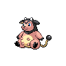
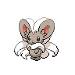

# Route 5

| Area                                                                       | Pokemon                                                                       | &nbsp;                                                                        | &nbsp;                                                                        | &nbsp;                                                                          | &nbsp;                                                                        | &nbsp;                                                                        |
| -------------------------------------------------------------------------- | ----------------------------------------------------------------------------- | ----------------------------------------------------------------------------- | ----------------------------------------------------------------------------- | ------------------------------------------------------------------------------- | ----------------------------------------------------------------------------- | ----------------------------------------------------------------------------- |
|  grass-normal     |   [Solosis](/pokemon/577)  20%   |   [Gothita](/pokemon/574)  20%   |   [Koffing](/pokemon/109)  10%   |   [Trubbish](/pokemon/568)  10%   |   [Gulpin](/pokemon/316)  10%     |   [Grimer](/pokemon/088)  10%     |
|                                                                            |   [Ditto](/pokemon/132)  5%        |   [Mime-jr](/pokemon/439)  5%    |   [Bonsly](/pokemon/438)  5%      |   [Pachirisu](/pokemon/417)  5%  |
|  grass-doubles  |   [Nidorina](/pokemon/030)  20% |   [Nidorino](/pokemon/033)  20% |   [Rufflet](/pokemon/627)  10%   |   [Lickitung](/pokemon/108)  10% |   [Smeargle](/pokemon/235)  10% |   [Minccino](/pokemon/572)  10% |
|                                                                            |   [Miltank](/pokemon/241)  5%    |   [Tauros](/pokemon/128)  5%      |   [Bagon](/pokemon/371)  5%        |   [Munchlax](/pokemon/446)  5%    |
|  grass-special  |   [Audino](/pokemon/531)  60%     |   [Emolga](/pokemon/587)  20%     |   [Cinccino](/pokemon/573)  10% |   [Nidoqueen](/pokemon/031)  10% |   [Nidoking](/pokemon/034)  10% |   [Braviary](/pokemon/628)  10% |