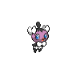
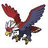

# Route 5

| Area                                                                       | Pokemon                                                                                        | &nbsp;                                                                                         | &nbsp;                                                                                         | &nbsp;                                                                                           | &nbsp;                                                                                         | &nbsp;                                                                                         |
| -------------------------------------------------------------------------- | ---------------------------------------------------------------------------------------------- | ---------------------------------------------------------------------------------------------- | ---------------------------------------------------------------------------------------------- | ------------------------------------------------------------------------------------------------ | ---------------------------------------------------------------------------------------------- | ---------------------------------------------------------------------------------------------- |
|  grass-normal     |   [Solosis](/blaze-black-wiki/pokemon/577)  20%   |   [Gothita](/blaze-black-wiki/pokemon/574)  20%   |   [Koffing](/blaze-black-wiki/pokemon/109)  10%   |   [Trubbish](/blaze-black-wiki/pokemon/568)  10%   |   [Gulpin](/blaze-black-wiki/pokemon/316)  10%     |   [Grimer](/blaze-black-wiki/pokemon/088)  10%     |
|                                                                            |   [Ditto](/blaze-black-wiki/pokemon/132)  5%        |   [Mime-jr](/blaze-black-wiki/pokemon/439)  5%    |   [Bonsly](/blaze-black-wiki/pokemon/438)  5%      |   [Pachirisu](/blaze-black-wiki/pokemon/417)  5%  |
|  grass-doubles  |   [Nidorina](/blaze-black-wiki/pokemon/030)  20% |   [Nidorino](/blaze-black-wiki/pokemon/033)  20% |   [Rufflet](/blaze-black-wiki/pokemon/627)  10%   |   [Lickitung](/blaze-black-wiki/pokemon/108)  10% |   [Smeargle](/blaze-black-wiki/pokemon/235)  10% |   [Minccino](/blaze-black-wiki/pokemon/572)  10% |
|                                                                            |   [Miltank](/blaze-black-wiki/pokemon/241)  5%    |   [Tauros](/blaze-black-wiki/pokemon/128)  5%      |   [Bagon](/blaze-black-wiki/pokemon/371)  5%        |   [Munchlax](/blaze-black-wiki/pokemon/446)  5%    |
|  grass-special  |   [Audino](/blaze-black-wiki/pokemon/531)  60%     |   [Emolga](/blaze-black-wiki/pokemon/587)  20%     |   [Cinccino](/blaze-black-wiki/pokemon/573)  10% |   [Nidoqueen](/blaze-black-wiki/pokemon/031)  10% |   [Nidoking](/blaze-black-wiki/pokemon/034)  10% |   [Braviary](/blaze-black-wiki/pokemon/628)  10% |