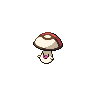
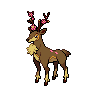

# Route 6 - spring|summer|autumn

| Area                                                                             | Pokemon                                                                       | &nbsp;                                                                         | &nbsp;                                                                        | &nbsp;                                                                      | &nbsp;                                                                          | &nbsp;                                                                |
| -------------------------------------------------------------------------------- | ----------------------------------------------------------------------------- | ------------------------------------------------------------------------------ | ----------------------------------------------------------------------------- | --------------------------------------------------------------------------- | ------------------------------------------------------------------------------- | --------------------------------------------------------------------- |
|  grass-normal           |   [Cherubi](/pokemon/420)  20%   |   [Deerling](/pokemon/585)  20%  |   [Stantler](/pokemon/234)  10% |   [Foongus](/pokemon/590)  10% |   [Pidgeotto](/pokemon/017)  10% |   [Natu](/pokemon/177)  10% |
|                                                                                  |   [Mr-mime](/pokemon/122)  5%    |   [Bonsly](/pokemon/438)  5%       |   [Plusle](/pokemon/311)  5%      |   [Minun](/pokemon/312)  5%      |
|  grass-doubles        |   [Cherrim](/pokemon/421)  20%   |   [Sawsbuck](/pokemon/586)  20%  |   [Stantler](/pokemon/234)  10% |   [Foongus](/pokemon/590)  10% |   [Pidgeotto](/pokemon/017)  10% |   [Xatu](/pokemon/178)  10% |
|                                                                                  |   [Mr-mime](/pokemon/122)  5%    |   [Sudowoodo](/pokemon/185)  5% |   [Plusle](/pokemon/311)  5%      |   [Minun](/pokemon/312)  5%      |
|  surf-normal              |   [Finneon](/pokemon/456)  60%   |   [Goldeen](/pokemon/118)  30%    |   [Chinchou](/pokemon/170)  10% |
|  surf-special           |   [Lumineon](/pokemon/457)  60% |   [Lanturn](/pokemon/171)  30%    |   [Seaking](/pokemon/119)  10%   |
|  fishing-normal     |   [Finneon](/pokemon/456)  60%   |   [Chinchou](/pokemon/170)  40%  |
|  fishing-special  |   [Lumineon](/pokemon/457)  60% |   [Lanturn](/pokemon/171)  40%    |