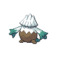

# Route 6 - winter

| Area                                                                             | Pokemon                                                                     | &nbsp;                                                                         | &nbsp;                                                                        | &nbsp;                                                                       | &nbsp;                                                                          | &nbsp;                                                                |
| -------------------------------------------------------------------------------- | --------------------------------------------------------------------------- | ------------------------------------------------------------------------------ | ----------------------------------------------------------------------------- | ---------------------------------------------------------------------------- | ------------------------------------------------------------------------------- | --------------------------------------------------------------------- |
|  grass-normal           |   [Snover](/pokemon/459)  20%   |   [Deerling](/pokemon/585)  20%  |   [Stantler](/pokemon/234)  10% |   [Foongus](/pokemon/590)  10%  |   [Pidgeotto](/pokemon/017)  10% |   [Natu](/pokemon/177)  10% |
|                                                                                  |   [Mime-jr](/pokemon/439)  5%  |   [Bonsly](/pokemon/438)  5%       |   [Plusle](/pokemon/311)  5%      |   [Minun](/pokemon/312)  5%       |
|  grass-doubles        |   [Snover](/pokemon/459)  20%   |   [Sawsbuck](/pokemon/586)  20%  |   [Stantler](/pokemon/234)  10% |   [Foongus](/pokemon/590)  10%  |   [Pidgeotto](/pokemon/017)  10% |   [Xatu](/pokemon/178)  10% |
|                                                                                  |   [Mr-mime](/pokemon/122)  5%  |   [Sudowoodo](/pokemon/185)  5% |   [Plusle](/pokemon/311)  5%      |   [Minun](/pokemon/312)  5%       |
|  grass-special        |   [Chansey](/pokemon/113)  80% |   [Emolga](/pokemon/587)  10%      |   [Leavanny](/pokemon/542)  5%  |   [Unfezant](/pokemon/521)  5% |
|  surf-normal              |   [Seel](/pokemon/086)  60%       |   [Spheal](/pokemon/363)  30%      |   [Chinchou](/pokemon/170)  10% |
|  surf-special           |   [Dewgong](/pokemon/087)  60% |   [Sealeo](/pokemon/364)  30%      |   [Chinchou](/pokemon/170)  10% |
|  fishing-normal     |   [Seel](/pokemon/086)  60%       |   [Spheal](/pokemon/363)  30%      |   [Chinchou](/pokemon/170)  10% |
|  fishing-special  |   [Dewgong](/pokemon/087)  60% |   [Sealeo](/pokemon/364)  30%      |   [Lanturn](/pokemon/171)  10%   |