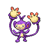
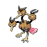
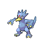

# Route 7

| Trainer             | 1                                                                                                      | 2                                                                                  | 3                                                                                  |
| ------------------- | ------------------------------------------------------------------------------------------------------ | ---------------------------------------------------------------------------------- | ---------------------------------------------------------------------------------- |
| Youngster Mikey     |   [Tauros](/pokemon/128)  Lv. 44                           |   [Hitmonlee](/pokemon/106)  Lv. 44 |   [Stoutland](/pokemon/508)  Lv. 44 |
| Youngster Parker    |   [Darmanitan-standard](/pokemon/555)  Lv. 44 |   [Accelgor](/pokemon/617)  Lv. 44   |   [Breloom](/pokemon/286)  Lv. 44     |
| Backpacker Terrance |   [Grumpig](/pokemon/326)  Lv. 45                         |   [Huntail](/pokemon/367)  Lv. 45     |
| Ace Trainer Elmer   |   [Venusaur](/pokemon/003)  Lv. 45                       |   [Charizard](/pokemon/006)  Lv. 45 |   [Blastoise](/pokemon/009)  Lv. 45 |
| Backpacker Ruth     |   [Venomoth](/pokemon/049)  Lv. 45                       |   [Rapidash](/pokemon/078)  Lv. 45   |
| Pkmn Ranger Mary    |   [Stantler](/pokemon/234)  Lv. 44                       |   [Ambipom](/pokemon/424)  Lv. 44     |   [Altaria](/pokemon/334)  Lv. 44     |
| Pkmn Ranger Pedro   |   [Deino](/pokemon/633)  Lv. 45                             |   [Heatmor](/pokemon/631)  Lv. 45     |
| Harlequin Ian       |   [Clefable](/pokemon/036)  Lv. 44                       |   [Dodrio](/pokemon/085)  Lv. 44       |   [Golduck](/pokemon/055)  Lv. 44     |
| Harlequin Pat       |   [Victreebel](/pokemon/071)  Lv. 44                   |   [Hitmontop](/pokemon/237)  Lv. 44 |   [Meganium](/pokemon/154)  Lv. 44   |