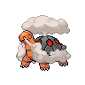

# Route 7

| Area                                                                       | Pokemon                                                                                        | &nbsp;                                                                                            | &nbsp;                                                                                       | &nbsp;                                                                                       | &nbsp;                                                                                     | &nbsp;                                                                                       |
| -------------------------------------------------------------------------- | ---------------------------------------------------------------------------------------------- | ------------------------------------------------------------------------------------------------- | -------------------------------------------------------------------------------------------- | -------------------------------------------------------------------------------------------- | ------------------------------------------------------------------------------------------ | -------------------------------------------------------------------------------------------- |
|  grass-normal     |   [Ponyta](/blaze-black-wiki/pokemon/077)  20%     |   [Aipom](/blaze-black-wiki/pokemon/190)  20%          |   [Magby](/blaze-black-wiki/pokemon/240)  10%     |   [Nincada](/blaze-black-wiki/pokemon/290)  10% |   [Doduo](/blaze-black-wiki/pokemon/084)  10%   |   [Cubone](/blaze-black-wiki/pokemon/104)  10%   |
|                                                                            |   [Skarmory](/blaze-black-wiki/pokemon/227)  5%  |   [Pachirisu](/blaze-black-wiki/pokemon/417)  5%   |   [Torkoal](/blaze-black-wiki/pokemon/324)  5%  |   [Gligar](/blaze-black-wiki/pokemon/207)  5%    |
|  grass-doubles  |   [Rapidash](/blaze-black-wiki/pokemon/078)  20% |   [Ambipom](/blaze-black-wiki/pokemon/424)  20%      |   [Magmar](/blaze-black-wiki/pokemon/126)  10%   |   [Ninjask](/blaze-black-wiki/pokemon/291)  10% |   [Dodrio](/blaze-black-wiki/pokemon/085)  10% |   [Marowak](/blaze-black-wiki/pokemon/105)  10% |
|                                                                            |   [Heatmor](/blaze-black-wiki/pokemon/631)  5%    |   [Bouffalant](/blaze-black-wiki/pokemon/626)  5% |   [Miltank](/blaze-black-wiki/pokemon/241)  5%  |   [Tauros](/blaze-black-wiki/pokemon/128)  5%    |
|  grass-special  |   [Audino](/blaze-black-wiki/pokemon/531)  60%     |   [Emolga](/blaze-black-wiki/pokemon/587)  30%        |   [Gliscor](/blaze-black-wiki/pokemon/472)  10% |