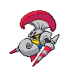
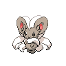

# Route 8

| Trainer             | 1                                                                                                                         | 2                                                                                                                         | 3                                                                                                     | 4                                                                                                 |
| ------------------- | ------------------------------------------------------------------------------------------------------------------------- | ------------------------------------------------------------------------------------------------------------------------- | ----------------------------------------------------------------------------------------------------- | ------------------------------------------------------------------------------------------------- |
| Pkmn Ranger Lewis   |   [Maractus](/blaze-black-wiki/pokemon/556)  Lv. 57                         |   [Politoed](/blaze-black-wiki/pokemon/186)  Lv. 57                         |   [Escavalier](/blaze-black-wiki/pokemon/589)  Lv. 57 |
| Parasol Lady Melita |   [Jellicent](/blaze-black-wiki/pokemon/593)  Lv. 58                       |   [Kingdra](/blaze-black-wiki/pokemon/230)  Lv. 58                           |
| Fisherman Bruce     |   [Basculin-red-striped](/blaze-black-wiki/pokemon/550)  Lv. 58 |   [Basculin-red-striped](/blaze-black-wiki/pokemon/550)  Lv. 58 |   [Kingler](/blaze-black-wiki/pokemon/099)  Lv. 58       |   [Whiscash](/blaze-black-wiki/pokemon/340)  Lv. 58 |
| Parasol Lady Lumi   |   [Flareon](/blaze-black-wiki/pokemon/136)  Lv. 58                           |   [Flygon](/blaze-black-wiki/pokemon/330)  Lv. 58                             |
| Pkmn Ranger Annie   |   [Tropius](/blaze-black-wiki/pokemon/357)  Lv. 58                           |   [Cinccino](/blaze-black-wiki/pokemon/573)  Lv. 58                         |   [Archeops](/blaze-black-wiki/pokemon/567)  Lv. 58     |

=== "Fire"

    | Trainer                                                                             | 1                                                                                               | 2                                                                                                 | 3                                                                                                 | 4                                                                                                     | 5                                                                                                 | 6                                                                                                   |
    | ----------------------------------------------------------------------------------- | ----------------------------------------------------------------------------------------------- | ------------------------------------------------------------------------------------------------- | ------------------------------------------------------------------------------------------------- | ----------------------------------------------------------------------------------------------------- | ------------------------------------------------------------------------------------------------- | --------------------------------------------------------------------------------------------------- |
    | Bianca   |   [Persian](/blaze-black-wiki/pokemon/053)  Lv. 61 |   [Musharna](/blaze-black-wiki/pokemon/518)  Lv. 59 |   [Mienshao](/blaze-black-wiki/pokemon/620)  Lv. 61 |   [Chandelure](/blaze-black-wiki/pokemon/609)  Lv. 63 |   [Simipour](/blaze-black-wiki/pokemon/516)  Lv. 63 |   [Serperior](/blaze-black-wiki/pokemon/497)  Lv. 65 |

=== "Water"

    | Trainer                                                                             | 1                                                                                               | 2                                                                                                 | 3                                                                                                 | 4                                                                                               | 5                                                                                                 | 6                                                                                             |
    | ----------------------------------------------------------------------------------- | ----------------------------------------------------------------------------------------------- | ------------------------------------------------------------------------------------------------- | ------------------------------------------------------------------------------------------------- | ----------------------------------------------------------------------------------------------- | ------------------------------------------------------------------------------------------------- | --------------------------------------------------------------------------------------------- |
    | Bianca   |   [Persian](/blaze-black-wiki/pokemon/053)  Lv. 61 |   [Musharna](/blaze-black-wiki/pokemon/518)  Lv. 59 |   [Mienshao](/blaze-black-wiki/pokemon/620)  Lv. 61 |   [Milotic](/blaze-black-wiki/pokemon/350)  Lv. 63 |   [Simisage](/blaze-black-wiki/pokemon/512)  Lv. 63 |   [Emboar](/blaze-black-wiki/pokemon/500)  Lv. 65 |

=== "Grass"

    | Trainer                                                                             | 1                                                                                               | 2                                                                                                 | 3                                                                                                 | 4                                                                                                   | 5                                                                                                 | 6                                                                                                 |
    | ----------------------------------------------------------------------------------- | ----------------------------------------------------------------------------------------------- | ------------------------------------------------------------------------------------------------- | ------------------------------------------------------------------------------------------------- | --------------------------------------------------------------------------------------------------- | ------------------------------------------------------------------------------------------------- | ------------------------------------------------------------------------------------------------- |
    | Bianca   |   [Persian](/blaze-black-wiki/pokemon/053)  Lv. 61 |   [Musharna](/blaze-black-wiki/pokemon/518)  Lv. 59 |   [Mienshao](/blaze-black-wiki/pokemon/620)  Lv. 61 |   [Lilligant](/blaze-black-wiki/pokemon/549)  Lv. 63 |   [Simisear](/blaze-black-wiki/pokemon/514)  Lv. 63 |   [Samurott](/blaze-black-wiki/pokemon/503)  Lv. 65 |

 

## Bianca

=== "Fire"

    |                                | Item                                                                 | Nature | Ability    | Moves                                                                                  |
    | ----------------------------------------------------------------------------------------------------- | -------------------------------------------------------------------- | ------ | ---------- | -------------------------------------------------------------------------------------- |
    |   [Persian](/blaze-black-wiki/pokemon/053)  Lv. 61       |    Chople berry | N/A    | Technician | <ul><li>Nasty-Plot</li><li>Hypnosis</li><li>Swift</li><li>Fake-Out</li></ul>           |
    |   [Musharna](/blaze-black-wiki/pokemon/518)  Lv. 59     |    Kasib berry    | N/A    | Analytic   | <ul><li>Hypnosis</li><li>Psychic</li><li>Energy-Ball</li><li>Reflect</li></ul>         |
    |   [Mienshao](/blaze-black-wiki/pokemon/620)  Lv. 61     |    Coba berry       | N/A    | Reckless   | <ul><li>High-Jump-Kick</li><li>U-Turn</li><li>Stone-Edge</li><li>Poison-Jab</li></ul>  |
    |   [Chandelure](/blaze-black-wiki/pokemon/609)  Lv. 63 |    Sitrus berry | N/A    | Levitate   | <ul><li>Flamethrower</li><li>Shadow-Ball</li><li>Will-O-Wisp</li><li>Psychic</li></ul> |
    |   [Simipour](/blaze-black-wiki/pokemon/516)  Lv. 63     |    Flying gem       | N/A    | Unburden   | <ul><li>Work-Up</li><li>Acrobatics</li><li>Focus-Blast</li><li>Water-Spout</li></ul>   |
    |   [Serperior](/blaze-black-wiki/pokemon/497)  Lv. 65   |    Leftovers          | N/A    | Contrary   | <ul><li>Leaf-Blade</li><li>Leech-Seed</li><li>Glare</li><li>Dragon-Pulse</li></ul>     |

=== "Water"

    |                            | Item                                                                 | Nature | Ability      | Moves                                                                                 |
    | ------------------------------------------------------------------------------------------------- | -------------------------------------------------------------------- | ------ | ------------ | ------------------------------------------------------------------------------------- |
    |   [Persian](/blaze-black-wiki/pokemon/053)  Lv. 61   |    Chople berry | N/A    | Technician   | <ul><li>Nasty-Plot</li><li>Hypnosis</li><li>Swift</li><li>Fake-Out</li></ul>          |
    |   [Musharna](/blaze-black-wiki/pokemon/518)  Lv. 59 |    Kasib berry    | N/A    | Analytic     | <ul><li>Hypnosis</li><li>Psychic</li><li>Energy-Ball</li><li>Reflect</li></ul>        |
    |   [Mienshao](/blaze-black-wiki/pokemon/620)  Lv. 61 |    Coba berry       | N/A    | Reckless     | <ul><li>High-Jump-Kick</li><li>U-Turn</li><li>Stone-Edge</li><li>Poison-Jab</li></ul> |
    |   [Milotic](/blaze-black-wiki/pokemon/350)  Lv. 63   |    Sitrus berry | N/A    | Multiscale   | <ul><li>Surf</li><li>Ice-Beam</li><li>Hypnosis</li><li>Dragon-Tail</li></ul>          |
    |   [Simisage](/blaze-black-wiki/pokemon/512)  Lv. 63 |    Flying gem       | N/A    | Unburden     | <ul><li>Work-Up</li><li>Acrobatics</li><li>Focus-Blast</li><li>Power-Whip</li></ul>   |
    |   [Emboar](/blaze-black-wiki/pokemon/500)  Lv. 65     |    Leftovers          | N/A    | Adaptability | <ul><li>Heat-Crash</li><li>Bulk-Up</li><li>Wild-Charge</li><li>Hammer-Arm</li></ul>   |

=== "Grass"

    |                              | Item                                                                 | Nature | Ability      | Moves                                                                                       |
    | --------------------------------------------------------------------------------------------------- | -------------------------------------------------------------------- | ------ | ------------ | ------------------------------------------------------------------------------------------- |
    |   [Persian](/blaze-black-wiki/pokemon/053)  Lv. 61     |    Chople berry | N/A    | Technician   | <ul><li>Nasty-Plot</li><li>Hypnosis</li><li>Swift</li><li>Fake-Out</li></ul>                |
    |   [Musharna](/blaze-black-wiki/pokemon/518)  Lv. 59   |    Kasib berry    | N/A    | Analytic     | <ul><li>Hypnosis</li><li>Psychic</li><li>Energy-Ball</li><li>Reflect</li></ul>              |
    |   [Mienshao](/blaze-black-wiki/pokemon/620)  Lv. 61   |    Coba berry       | N/A    | Reckless     | <ul><li>High-Jump-Kick</li><li>U-Turn</li><li>Stone-Edge</li><li>Poison-Jab</li></ul>       |
    |   [Lilligant](/blaze-black-wiki/pokemon/549)  Lv. 63 |    Sitrus berry | N/A    | Own-Tempo    | <ul><li>Petal-Dance</li><li>Hidden-Power</li><li>Sleep-Powder</li><li>Focus-Blast</li></ul> |
    |   [Simisear](/blaze-black-wiki/pokemon/514)  Lv. 63   |    Flying gem       | N/A    | Unburden     | <ul><li>Acrobatics</li><li>Focus-Blast</li><li>Work-Up</li><li>Fire-Blast</li></ul>         |
    |   [Samurott](/blaze-black-wiki/pokemon/503)  Lv. 65   |    Leftovers          | N/A    | Vital-Spirit | <ul><li>Scald</li><li>Swords-Dance</li><li>Megahorn</li><li>Ice-Beam</li></ul>              |