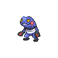
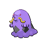
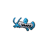

# Route 8

| Area                                                                             | Pokemon                                                                                          | &nbsp;                                                                                             | &nbsp;                                                                                         | &nbsp;                                                                                          | &nbsp;                                                                                       | &nbsp;                                                                                     |
| -------------------------------------------------------------------------------- | ------------------------------------------------------------------------------------------------ | -------------------------------------------------------------------------------------------------- | ---------------------------------------------------------------------------------------------- | ----------------------------------------------------------------------------------------------- | -------------------------------------------------------------------------------------------- | ------------------------------------------------------------------------------------------ |
|  puddle-normal        |   [Palpitoad](/blaze-black-wiki/pokemon/536)  20% |   [Stunfisk](/blaze-black-wiki/pokemon/618)  20%     |   [Croagunk](/blaze-black-wiki/pokemon/453)  10% |   [Gulpin](/blaze-black-wiki/pokemon/316)  10%      |   [Koffing](/blaze-black-wiki/pokemon/109)  10% |   [Grimer](/blaze-black-wiki/pokemon/088)  10% |
|                                                                                  |   [Gastrodon](/blaze-black-wiki/pokemon/423)  5%  |   [Quagsire](/blaze-black-wiki/pokemon/195)  5%      |   [Swalot](/blaze-black-wiki/pokemon/317)  4%      |   [Toxicroak](/blaze-black-wiki/pokemon/454)  4% |   [Weezing](/blaze-black-wiki/pokemon/110)  1%  |   [Muk](/blaze-black-wiki/pokemon/089)  1%        |
|  surf-normal              |   [Stunfisk](/blaze-black-wiki/pokemon/618)  60%   |   [Barboach](/blaze-black-wiki/pokemon/339)  40%     |
|  surf-special           |   [Whiscash](/blaze-black-wiki/pokemon/340)  60%   |   [Seismitoad](/blaze-black-wiki/pokemon/537)  40% |
|  fishing-normal     |   [Barboach](/blaze-black-wiki/pokemon/339)  70%   |   [Stunfisk](/blaze-black-wiki/pokemon/618)  30%     |
|  fishing-special  |   [Barboach](/blaze-black-wiki/pokemon/339)  60%   |   [Stunfisk](/blaze-black-wiki/pokemon/618)  30%     |   [Whiscash](/blaze-black-wiki/pokemon/340)  10% |