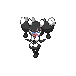
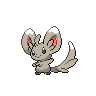

# Route 9

| Area                                                                       | Pokemon                                                                         | &nbsp;                                                                           | &nbsp;                                                                         | &nbsp;                                                                        | &nbsp;                                                                        | &nbsp;                                                                        |
| -------------------------------------------------------------------------- | ------------------------------------------------------------------------------- | -------------------------------------------------------------------------------- | ------------------------------------------------------------------------------ | ----------------------------------------------------------------------------- | ----------------------------------------------------------------------------- | ----------------------------------------------------------------------------- |
|  grass-normal     |   [Gothorita](/pokemon/575)  20% |   [Duosion](/pokemon/578)  20%      |   [Kirlia](/pokemon/281)  10%      |   [Minccino](/pokemon/572)  10% |   [Pawniard](/pokemon/624)  10% |   [Skitty](/pokemon/300)  10%     |
|                                                                            |   [Liepard](/pokemon/510)  10%     |   [Persian](/pokemon/053)  10%      |
|  grass-doubles  |   [Flaaffy](/pokemon/180)  20%     |   [Luxio](/pokemon/404)  20%          |   [Hypno](/pokemon/097)  10%        |   [Cinccino](/pokemon/573)  10% |   [Bisharp](/pokemon/625)  10%   |   [Garbodor](/pokemon/569)  10% |
|                                                                            |   [Houndoom](/pokemon/229)  10%   |   [Granbull](/pokemon/210)  10%    |
|  grass-special  |   [Audino](/pokemon/531)  90%       |   [Gothitelle](/pokemon/576)  5% |   [Reuniclus](/pokemon/579)  5% |
| legendary-encounter grass-special                                      |   [Raikou](/pokemon/243)  1%        |   [Entei](/pokemon/244)  1%           |