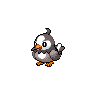
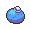

# Striaton city

=== "Fire"

    | Trainer                                                                             | 1                                                                            | 2                                                                                |
    | ----------------------------------------------------------------------------------- | ---------------------------------------------------------------------------- | -------------------------------------------------------------------------------- |
    | Cheren   |   [Starly](/pokemon/396)  Lv. 11 |   [Oshawott](/pokemon/501)  Lv. 12 |

=== "Water"

    | Trainer                                                                             | 1                                                                            | 2                                                                          |
    | ----------------------------------------------------------------------------------- | ---------------------------------------------------------------------------- | -------------------------------------------------------------------------- |
    | Cheren   |   [Starly](/pokemon/396)  Lv. 11 |   [Snivy](/pokemon/495)  Lv. 12 |

=== "Grass"

    | Trainer                                                                             | 1                                                                            | 2                                                                          |
    | ----------------------------------------------------------------------------------- | ---------------------------------------------------------------------------- | -------------------------------------------------------------------------- |
    | Cheren   |   [Starly](/pokemon/396)  Lv. 11 |   [Tepig](/pokemon/498)  Lv. 12 |

 

## Cheren

=== "Fire"

    |           | Item                                                           | Nature | Ability      | Moves                                                     |
    | -------------------------------------------------------------------------------- | -------------------------------------------------------------- | ------ | ------------ | --------------------------------------------------------- |
    |   [Starly](/pokemon/396)  Lv. 11     | N/A                                                            | N/A    | Keen-Eye     | <ul><li>N/A</li><li>N/A</li><li>N/A</li><li>N/A</li></ul> |
    |   [Oshawott](/pokemon/501)  Lv. 12 |    Oran berry | N/A    | Vital-Spirit | <ul><li>N/A</li><li>N/A</li><li>N/A</li><li>N/A</li></ul> |

=== "Water"

    |       | Item                                                           | Nature | Ability  | Moves                                                     |
    | ---------------------------------------------------------------------------- | -------------------------------------------------------------- | ------ | -------- | --------------------------------------------------------- |
    |   [Starly](/pokemon/396)  Lv. 11 | N/A                                                            | N/A    | Keen-Eye | <ul><li>N/A</li><li>N/A</li><li>N/A</li><li>N/A</li></ul> |
    |   [Snivy](/pokemon/495)  Lv. 12   |    Oran berry | N/A    | Contrary | <ul><li>N/A</li><li>N/A</li><li>N/A</li><li>N/A</li></ul> |

=== "Grass"

    |       | Item                                                           | Nature | Ability      | Moves                                                     |
    | ---------------------------------------------------------------------------- | -------------------------------------------------------------- | ------ | ------------ | --------------------------------------------------------- |
    |   [Starly](/pokemon/396)  Lv. 11 | N/A                                                            | N/A    | Keen-Eye     | <ul><li>N/A</li><li>N/A</li><li>N/A</li><li>N/A</li></ul> |
    |   [Tepig](/pokemon/498)  Lv. 12   |    Oran berry | N/A    | Adaptability | <ul><li>N/A</li><li>N/A</li><li>N/A</li><li>N/A</li></ul> |