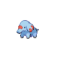
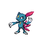
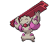

# Twist mountain - 1f

| Area                                                                    | Pokemon                                                                         | &nbsp;                                                                          | &nbsp;                                                                         | &nbsp;                                                                      | &nbsp;                                                                        | &nbsp;                                                                    |
| ----------------------------------------------------------------------- | ------------------------------------------------------------------------------- | ------------------------------------------------------------------------------- | ------------------------------------------------------------------------------ | --------------------------------------------------------------------------- | ----------------------------------------------------------------------------- | ------------------------------------------------------------------------- |
|  cave-normal     |   [Phanpy](/pokemon/231)  20%       |   [Teddiursa](/pokemon/216)  20% |   [Cubchoo](/pokemon/613)  10%    |   [Sneasel](/pokemon/215)  10% |   [Delibird](/pokemon/225)  10% |   [Swinub](/pokemon/220)  10% |
|                                                                         |   [Graveler](/pokemon/075)  5%    |   [Boldore](/pokemon/525)  5%      |   [Cryogonal](/pokemon/615)  5% |   [Gurdurr](/pokemon/533)  5%  |
|  cave-special  |   [Excadrill](/pokemon/530)  50% |   [Dugtrio](/pokemon/051)  50%     |