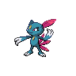

# Twist mountain - not 1f

| Area                                                                                                                             | Pokemon                                                                         | &nbsp;                                                                        | &nbsp;                                                                         | &nbsp;                                                                      | &nbsp;                                                                        | &nbsp;                                                                          |
| -------------------------------------------------------------------------------------------------------------------------------- | ------------------------------------------------------------------------------- | ----------------------------------------------------------------------------- | ------------------------------------------------------------------------------ | --------------------------------------------------------------------------- | ----------------------------------------------------------------------------- | ------------------------------------------------------------------------------- |
|  cave-normal                                                              |   [Donphan](/pokemon/232)  20%     |   [Ursaring](/pokemon/217)  20% |   [Beartic](/pokemon/614)  10%    |   [Sneasel](/pokemon/215)  10% |   [Delibird](/pokemon/225)  10% |   [Piloswine](/pokemon/221)  10% |
|                                                                                                                                  |   [Sableye](/pokemon/302)  5%      |   [Mawile](/pokemon/303)  5%      |   [Cryogonal](/pokemon/615)  5% |   [Durant](/pokemon/632)  5%    |
|  cave-special                                                           |   [Excadrill](/pokemon/530)  50% |   [Dugtrio](/pokemon/051)  50%   |
|  legendary-encounter cave-normal  |   [Regice](/pokemon/378)  1%        |