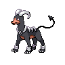
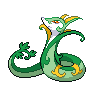
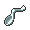
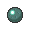

# Twist mountain - outside

| Trainer       | 1                                                                                | 2                                                                                |
| ------------- | -------------------------------------------------------------------------------- | -------------------------------------------------------------------------------- |
| Hiker Terrell |   [Magcargo](/pokemon/219)  Lv. 45 |   [Swampert](/pokemon/260)  Lv. 45 |

=== "Fire"

    | Trainer                                                                             | 1                                                                                  | 2                                                                                | 3                                                                                | 4                                                                                    | 5                                                                                | 6                                                                                |
    | ----------------------------------------------------------------------------------- | ---------------------------------------------------------------------------------- | -------------------------------------------------------------------------------- | -------------------------------------------------------------------------------- | ------------------------------------------------------------------------------------ | -------------------------------------------------------------------------------- | -------------------------------------------------------------------------------- |
    | Cheren   |   [Staraptor](/pokemon/398)  Lv. 53 |   [Gigalith](/pokemon/526)  Lv. 53 |   [Alakazam](/pokemon/065)  Lv. 53 |   [Whimsicott](/pokemon/547)  Lv. 53 |   [Simisear](/pokemon/514)  Lv. 53 |   [Samurott](/pokemon/503)  Lv. 55 |

=== "Grass"

    | Trainer                                                                             | 1                                                                                  | 2                                                                                | 3                                                                                | 4                                                                                | 5                                                                                | 6                                                                            |
    | ----------------------------------------------------------------------------------- | ---------------------------------------------------------------------------------- | -------------------------------------------------------------------------------- | -------------------------------------------------------------------------------- | -------------------------------------------------------------------------------- | -------------------------------------------------------------------------------- | ---------------------------------------------------------------------------- |
    | Cheren   |   [Staraptor](/pokemon/398)  Lv. 53 |   [Gigalith](/pokemon/526)  Lv. 53 |   [Alakazam](/pokemon/065)  Lv. 53 |   [Gyarados](/pokemon/130)  Lv. 53 |   [Simisage](/pokemon/512)  Lv. 53 |   [Emboar](/pokemon/500)  Lv. 55 |

=== "Water"

    | Trainer                                                                             | 1                                                                                  | 2                                                                                | 3                                                                                | 4                                                                                | 5                                                                                | 6                                                                                  |
    | ----------------------------------------------------------------------------------- | ---------------------------------------------------------------------------------- | -------------------------------------------------------------------------------- | -------------------------------------------------------------------------------- | -------------------------------------------------------------------------------- | -------------------------------------------------------------------------------- | ---------------------------------------------------------------------------------- |
    | Cheren   |   [Staraptor](/pokemon/398)  Lv. 53 |   [Gigalith](/pokemon/526)  Lv. 53 |   [Alakazam](/pokemon/065)  Lv. 53 |   [Houndoom](/pokemon/229)  Lv. 53 |   [Simipour](/pokemon/516)  Lv. 53 |   [Serperior](/pokemon/497)  Lv. 55 |

 

## Cheren

=== "Fire"

    |               | Item                                                                    | Nature | Ability      | Moves                                                                                  |
    | ------------------------------------------------------------------------------------ | ----------------------------------------------------------------------- | ------ | ------------ | -------------------------------------------------------------------------------------- |
    |   [Staraptor](/pokemon/398)  Lv. 53   |    Sharp beak          | N/A    | Reckless     | <ul><li>Brave-Bird</li><li>Close-Combat</li><li>Retaliate</li><li>U-Turn</li></ul>     |
    |   [Gigalith](/pokemon/526)  Lv. 53     |    Hard stone          | N/A    | Sturdy       | <ul><li>Stone-Edge</li><li>Stealth-Rock</li><li>Earthquake</li><li>Explosion</li></ul> |
    |   [Alakazam](/pokemon/065)  Lv. 53     |    Twisted spoon | N/A    | Magic-Guard  | <ul><li>Psychic</li><li>Shadow-Ball</li><li>Energy-Ball</li><li>Charge-Beam</li></ul>  |
    |   [Whimsicott](/pokemon/547)  Lv. 53 |    Lum berry             | N/A    | Prankster    | <ul><li>Energy-Ball</li><li>Hurricane</li><li>Tailwind</li><li>Cotton-Guard</li></ul>  |
    |   [Simisear](/pokemon/514)  Lv. 53     |    Iron ball             | N/A    | Blaze        | <ul><li>Flame-Burst</li><li>Acrobatics</li><li>Fling</li><li>Blast-Burn</li></ul>      |
    |   [Samurott](/pokemon/503)  Lv. 55     |    Sitrus berry    | N/A    | Vital-Spirit | <ul><li>Scald</li><li>Swords-Dance</li><li>Megahorn</li><li>Sacred-Sword</li></ul>     |

=== "Grass"

    |             | Item                                                                    | Nature | Ability      | Moves                                                                                  |
    | ---------------------------------------------------------------------------------- | ----------------------------------------------------------------------- | ------ | ------------ | -------------------------------------------------------------------------------------- |
    |   [Staraptor](/pokemon/398)  Lv. 53 |    Sharp beak          | N/A    | Reckless     | <ul><li>Brave-Bird</li><li>Close-Combat</li><li>Retaliate</li><li>U-Turn</li></ul>     |
    |   [Gigalith](/pokemon/526)  Lv. 53   |    Hard stone          | N/A    | Sturdy       | <ul><li>Stone-Edge</li><li>Stealth-Rock</li><li>Earthquake</li><li>Explosion</li></ul> |
    |   [Alakazam](/pokemon/065)  Lv. 53   |    Twisted spoon | N/A    | Magic-Guard  | <ul><li>Psychic</li><li>Shadow-Ball</li><li>Energy-Ball</li><li>Charge-Beam</li></ul>  |
    |   [Gyarados](/pokemon/130)  Lv. 53   |    Lum berry             | N/A    | Moxie        | <ul><li>Aqua-Tail</li><li>Ice-Fang</li><li>Dragon-Dance</li><li>Earthquake</li></ul>   |
    |   [Simisage](/pokemon/512)  Lv. 53   |    Iron ball             | N/A    | Overgrow     | <ul><li>Seed-Bomb</li><li>Acrobatics</li><li>Fling</li><li>Frenzy-Plant</li></ul>      |
    |   [Emboar](/pokemon/500)  Lv. 55       |    Sitrus berry    | N/A    | Adaptability | <ul><li>Heat-Crash</li><li>Bulk-Up</li><li>Wild-Charge</li><li>Earthquake</li></ul>    |

=== "Water"

    |             | Item                                                                    | Nature | Ability     | Moves                                                                                    |
    | ---------------------------------------------------------------------------------- | ----------------------------------------------------------------------- | ------ | ----------- | ---------------------------------------------------------------------------------------- |
    |   [Staraptor](/pokemon/398)  Lv. 53 |    Sharp beak          | N/A    | Reckless    | <ul><li>Brave-Bird</li><li>Close-Combat</li><li>Retaliate</li><li>U-Turn</li></ul>       |
    |   [Gigalith](/pokemon/526)  Lv. 53   |    Hard stone          | N/A    | Sturdy      | <ul><li>Stone-Edge</li><li>Stealth-Rock</li><li>Earthquake</li><li>Explosion</li></ul>   |
    |   [Alakazam](/pokemon/065)  Lv. 53   |    Twisted spoon | N/A    | Magic-Guard | <ul><li>Psychic</li><li>Shadow-Ball</li><li>Energy-Ball</li><li>Charge-Beam</li></ul>    |
    |   [Houndoom](/pokemon/229)  Lv. 53   |    Lum berry             | N/A    | Intimidate  | <ul><li>Flamethrower</li><li>Dark-Pulse</li><li>Nasty-Plot</li><li>Will-O-Wisp</li></ul> |
    |   [Simipour](/pokemon/516)  Lv. 53   |    Iron ball             | N/A    | Torrent     | <ul><li>Scald</li><li>Acrobatics</li><li>Fling</li><li>Hydro-Cannon</li></ul>            |
    |   [Serperior](/pokemon/497)  Lv. 55 |    Sitrus berry    | N/A    | Contrary    | <ul><li>Leaf-Blade</li><li>Leech-Seed</li><li>Glare</li><li>Dragon-Pulse</li></ul>       |