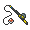

# Undella town

| Area                                                                             | Pokemon                                                                                           | &nbsp;                                                                                         | &nbsp;                                                                                          | &nbsp;                                                                                        |
| -------------------------------------------------------------------------------- | ------------------------------------------------------------------------------------------------- | ---------------------------------------------------------------------------------------------- | ----------------------------------------------------------------------------------------------- | --------------------------------------------------------------------------------------------- |
|  surf-normal              |   [Luvdisc](/blaze-black-wiki/pokemon/370)  60%      |   [Corsola](/blaze-black-wiki/pokemon/222)  40%   |
|  surf-special           |   [Alomomola](/blaze-black-wiki/pokemon/594)  100% |
|  fishing-normal     |   [Remoraid](/blaze-black-wiki/pokemon/223)  65%    |   [Shellder](/blaze-black-wiki/pokemon/090)  30% |   [Luvdisc](/blaze-black-wiki/pokemon/370)  5%     |
|  fishing-special  |   [Shellder](/blaze-black-wiki/pokemon/090)  60%    |   [Luvdisc](/blaze-black-wiki/pokemon/370)  30%   |   [Octillery](/blaze-black-wiki/pokemon/224)  5% |   [Cloyster](/blaze-black-wiki/pokemon/091)  5% |