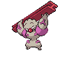

# Victory road - inside

| Area                                                                                                                                      | Pokemon                                                                                               | &nbsp;                                                                          | &nbsp;                                                                        | &nbsp;                                                                          | &nbsp;                                                                        | &nbsp;                                                                        |
| ----------------------------------------------------------------------------------------------------------------------------------------- | ----------------------------------------------------------------------------------------------------- | ------------------------------------------------------------------------------- | ----------------------------------------------------------------------------- | ------------------------------------------------------------------------------- | ----------------------------------------------------------------------------- | ----------------------------------------------------------------------------- |
|  cave-normal                                                                       |   [Donphan](/pokemon/232)  20%                           |   [Ursaring](/pokemon/217)  20%   |   [Zweilous](/pokemon/634)  10% |   [Woobat](/pokemon/527)  10%       |   [Hariyama](/pokemon/297)  10% |   [Medicham](/pokemon/308)  10% |
|                                                                                                                                           |   [Lairon](/pokemon/305)  10%                             |   [Azumarill](/pokemon/184)  10% |
|  cave-special                                                                    |   [Excadrill](/pokemon/530)  25%                       |   [Dugtrio](/pokemon/051)  25%     |   [Steelix](/pokemon/208)  25%   |   [Sandslash](/pokemon/028)  25% |
|  surf-normal                                                                       |   [Dewgong](/pokemon/087)  60%                           |   [Lapras](/pokemon/131)  40%       |
|  surf-special                                                                    |   [Lapras](/pokemon/131)  60%                             |   [Dewgong](/pokemon/087)  40%     |
|  fishing-normal                                                              |   [Basculin-red-striped](/pokemon/550)  60% |   [Gyarados](/pokemon/130)  30%   |   [Whiscash](/pokemon/340)  10% |
|  fishing-special                                                           |   [Basculin-red-striped](/pokemon/550)  60% |   [Gyarados](/pokemon/130)  30%   |   [Whiscash](/pokemon/340)  10% |
| .png) cave-normal (rooms without water)     |   [Loudred](/pokemon/294)  20%                           |   [Durant](/pokemon/632)  20%       |   [Woobat](/pokemon/527)  10%     |   [Golbat](/pokemon/042)  10%       |   [Klang](/pokemon/600)  10%       |   [Rhydon](/pokemon/112)  10%     |
|                                                                                                                                           |   [Boldore](/pokemon/525)  10%                           |   [Gurdurr](/pokemon/533)  10%     |
| .png) cave-special (rooms without water)  |   [Excadrill](/pokemon/530)  25%                       |   [Dugtrio](/pokemon/051)  25%     |   [Steelix](/pokemon/208)  25%   |   [Sandslash](/pokemon/028)  25% |