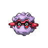
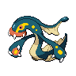
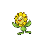
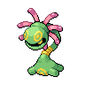
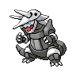
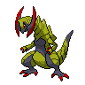
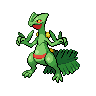
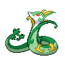

# Victory road

| Trainer            | 1                                                                                                   | 2                                                                                                   | 3                                                                                                 | 4                                                                                                     | 5                                                                                                     |
| ------------------ | --------------------------------------------------------------------------------------------------- | --------------------------------------------------------------------------------------------------- | ------------------------------------------------------------------------------------------------- | ----------------------------------------------------------------------------------------------------- | ----------------------------------------------------------------------------------------------------- |
| Ace Trainer Shante |   [Slowking](/blaze-black-wiki/pokemon/199)  Lv. 66   |   [Kingdra](/blaze-black-wiki/pokemon/230)  Lv. 66     |   [Ludicolo](/blaze-black-wiki/pokemon/272)  Lv. 66 |   [Forretress](/blaze-black-wiki/pokemon/205)  Lv. 66 |   [Eelektross](/blaze-black-wiki/pokemon/604)  Lv. 66 |
| Ace Trainer Dwayne |   [Volcarona](/blaze-black-wiki/pokemon/637)  Lv. 66 |   [Jumpluff](/blaze-black-wiki/pokemon/189)  Lv. 66   |   [Gliscor](/blaze-black-wiki/pokemon/472)  Lv. 66   |   [Solrock](/blaze-black-wiki/pokemon/338)  Lv. 66       |   [Sunflora](/blaze-black-wiki/pokemon/192)  Lv. 66     |
| Veteran Tiffany    |   [Arcanine](/blaze-black-wiki/pokemon/059)  Lv. 67   |   [Archeops](/blaze-black-wiki/pokemon/567)  Lv. 67   |   [Alakazam](/blaze-black-wiki/pokemon/065)  Lv. 67 |   [Flygon](/blaze-black-wiki/pokemon/330)  Lv. 67         |   [Cradily](/blaze-black-wiki/pokemon/346)  Lv. 67       |
| Black Belt Tyrone  |   [Poliwrath](/blaze-black-wiki/pokemon/062)  Lv. 67 |   [Mienshao](/blaze-black-wiki/pokemon/620)  Lv. 67   |   [Aggron](/blaze-black-wiki/pokemon/306)  Lv. 67     |   [Conkeldurr](/blaze-black-wiki/pokemon/534)  Lv. 67 |   [Metagross](/blaze-black-wiki/pokemon/376)  Lv. 67   |
| Ace Trainer Cathy  |   [Abomasnow](/blaze-black-wiki/pokemon/460)  Lv. 67 |   [Pelipper](/blaze-black-wiki/pokemon/279)  Lv. 67   |   [Jynx](/blaze-black-wiki/pokemon/124)  Lv. 67         |   [Starmie](/blaze-black-wiki/pokemon/121)  Lv. 67       |   [Lunatone](/blaze-black-wiki/pokemon/337)  Lv. 67     |
| Doctor Logan       |   [Audino](/blaze-black-wiki/pokemon/531)  Lv. 65       |   [Musharna](/blaze-black-wiki/pokemon/518)  Lv. 65   |   [Blissey](/blaze-black-wiki/pokemon/242)  Lv. 65   |   [Reuniclus](/blaze-black-wiki/pokemon/579)  Lv. 65   |   [Meganium](/blaze-black-wiki/pokemon/154)  Lv. 65     |
| Ace Trainer David  |   [Tyranitar](/blaze-black-wiki/pokemon/248)  Lv. 67 |   [Excadrill](/blaze-black-wiki/pokemon/530)  Lv. 67 |   [Steelix](/blaze-black-wiki/pokemon/208)  Lv. 67   |   [Golem](/blaze-black-wiki/pokemon/076)  Lv. 67           |   [Garchomp](/blaze-black-wiki/pokemon/445)  Lv. 67     |
| Veteran Martell    |   [Slaking](/blaze-black-wiki/pokemon/289)  Lv. 68     |   [Haxorus](/blaze-black-wiki/pokemon/612)  Lv. 68     |   [Sceptile](/blaze-black-wiki/pokemon/254)  Lv. 68 |   [Aggron](/blaze-black-wiki/pokemon/306)  Lv. 68         |   [Dusclops](/blaze-black-wiki/pokemon/356)  Lv. 68     |

=== "Fire"

    | Trainer                                                                             | 1                                                                                                   | 2                                                                                                 | 3                                                                                                 | 4                                                                                                     | 5                                                                                                 | 6                                                                                                 |
    | ----------------------------------------------------------------------------------- | --------------------------------------------------------------------------------------------------- | ------------------------------------------------------------------------------------------------- | ------------------------------------------------------------------------------------------------- | ----------------------------------------------------------------------------------------------------- | ------------------------------------------------------------------------------------------------- | ------------------------------------------------------------------------------------------------- |
    | Cheren   |   [Staraptor](/blaze-black-wiki/pokemon/398)  Lv. 88 |   [Gigalith](/blaze-black-wiki/pokemon/526)  Lv. 88 |   [Alakazam](/blaze-black-wiki/pokemon/065)  Lv. 88 |   [Whimsicott](/blaze-black-wiki/pokemon/547)  Lv. 88 |   [Simisear](/blaze-black-wiki/pokemon/514)  Lv. 88 |   [Samurott](/blaze-black-wiki/pokemon/503)  Lv. 90 |

=== "Water"

    | Trainer                                                                             | 1                                                                                                   | 2                                                                                                 | 3                                                                                                 | 4                                                                                                 | 5                                                                                                 | 6                                                                                                   |
    | ----------------------------------------------------------------------------------- | --------------------------------------------------------------------------------------------------- | ------------------------------------------------------------------------------------------------- | ------------------------------------------------------------------------------------------------- | ------------------------------------------------------------------------------------------------- | ------------------------------------------------------------------------------------------------- | --------------------------------------------------------------------------------------------------- |
    | Cheren   |   [Staraptor](/blaze-black-wiki/pokemon/398)  Lv. 88 |   [Gigalith](/blaze-black-wiki/pokemon/526)  Lv. 88 |   [Alakazam](/blaze-black-wiki/pokemon/065)  Lv. 88 |   [Houndoom](/blaze-black-wiki/pokemon/229)  Lv. 88 |   [Simipour](/blaze-black-wiki/pokemon/516)  Lv. 88 |   [Serperior](/blaze-black-wiki/pokemon/497)  Lv. 90 |

=== "Grass"

    | Trainer                                                                             | 1                                                                                                   | 2                                                                                                 | 3                                                                                                 | 4                                                                                                 | 5                                                                                                 | 6                                                                                             |
    | ----------------------------------------------------------------------------------- | --------------------------------------------------------------------------------------------------- | ------------------------------------------------------------------------------------------------- | ------------------------------------------------------------------------------------------------- | ------------------------------------------------------------------------------------------------- | ------------------------------------------------------------------------------------------------- | --------------------------------------------------------------------------------------------- |
    | Cheren   |   [Staraptor](/blaze-black-wiki/pokemon/398)  Lv. 88 |   [Gigalith](/blaze-black-wiki/pokemon/526)  Lv. 88 |   [Alakazam](/blaze-black-wiki/pokemon/065)  Lv. 88 |   [Gyarados](/blaze-black-wiki/pokemon/130)  Lv. 88 |   [Simisage](/blaze-black-wiki/pokemon/512)  Lv. 88 |   [Emboar](/blaze-black-wiki/pokemon/500)  Lv. 90 |

 

## Cheren

=== "Fire"

    |                                | Item                                                                 | Nature | Ability      | Moves                                                                                  |
    | ----------------------------------------------------------------------------------------------------- | -------------------------------------------------------------------- | ------ | ------------ | -------------------------------------------------------------------------------------- |
    |   [Staraptor](/blaze-black-wiki/pokemon/398)  Lv. 88   |    Life orb             | N/A    | Reckless     | <ul><li>Brave-Bird</li><li>Close-Combat</li><li>Double-Edge</li><li>U-Turn</li></ul>   |
    |   [Gigalith](/blaze-black-wiki/pokemon/526)  Lv. 88     |    Custap berry | N/A    | Sturdy       | <ul><li>Stone-Edge</li><li>Stealth-Rock</li><li>Earthquake</li><li>Explosion</li></ul> |
    |   [Alakazam](/blaze-black-wiki/pokemon/065)  Lv. 88     |    Life orb             | N/A    | Magic-Guard  | <ul><li>Psychic</li><li>Shadow-Ball</li><li>Energy-Ball</li><li>Focus-Blast</li></ul>  |
    |   [Whimsicott](/blaze-black-wiki/pokemon/547)  Lv. 88 |    Leftovers          | N/A    | Prankster    | <ul><li>Leech-Seed</li><li>Hurricane</li><li>Substitute</li><li>Cotton-Guard</li></ul> |
    |   [Simisear](/blaze-black-wiki/pokemon/514)  Lv. 88     |    Flying gem       | N/A    | Blaze        | <ul><li>Work-Up</li><li>Acrobatics</li><li>Focus-Blast</li><li>Fire-Blast</li></ul>    |
    |   [Samurott](/blaze-black-wiki/pokemon/503)  Lv. 90     |    Life orb             | N/A    | Vital-Spirit | <ul><li>Hydro-Pump</li><li>Shell-Smash</li><li>Megahorn</li><li>Secret-Sword</li></ul> |

=== "Water"

    |                              | Item                                                                 | Nature | Ability     | Moves                                                                                    |
    | --------------------------------------------------------------------------------------------------- | -------------------------------------------------------------------- | ------ | ----------- | ---------------------------------------------------------------------------------------- |
    |   [Staraptor](/blaze-black-wiki/pokemon/398)  Lv. 88 |    Life orb             | N/A    | Reckless    | <ul><li>Brave-Bird</li><li>Close-Combat</li><li>Double-Edge</li><li>U-Turn</li></ul>     |
    |   [Gigalith](/blaze-black-wiki/pokemon/526)  Lv. 88   |    Custap berry | N/A    | Sturdy      | <ul><li>Stone-Edge</li><li>Stealth-Rock</li><li>Earthquake</li><li>Explosion</li></ul>   |
    |   [Alakazam](/blaze-black-wiki/pokemon/065)  Lv. 88   |    Life orb             | N/A    | Magic-Guard | <ul><li>Psychic</li><li>Shadow-Ball</li><li>Energy-Ball</li><li>Focus-Blast</li></ul>    |
    |   [Houndoom](/blaze-black-wiki/pokemon/229)  Lv. 88   |    Leftovers          | N/A    | Intimidate  | <ul><li>Flamethrower</li><li>Dark-Pulse</li><li>Nasty-Plot</li><li>Will-O-Wisp</li></ul> |
    |   [Simipour](/blaze-black-wiki/pokemon/516)  Lv. 88   |    Flying gem       | N/A    | Torrent     | <ul><li>Work-Up</li><li>Acrobatics</li><li>Focus-Blast</li><li>Water-Spout</li></ul>     |
    |   [Serperior](/blaze-black-wiki/pokemon/497)  Lv. 90 |    Life orb             | N/A    | Contrary    | <ul><li>Leaf-Storm</li><li>Leech-Seed</li><li>Glare</li><li>Draco-Meteor</li></ul>       |

=== "Grass"

    |                              | Item                                                                 | Nature | Ability      | Moves                                                                                  |
    | --------------------------------------------------------------------------------------------------- | -------------------------------------------------------------------- | ------ | ------------ | -------------------------------------------------------------------------------------- |
    |   [Staraptor](/blaze-black-wiki/pokemon/398)  Lv. 88 |    Life orb             | N/A    | Reckless     | <ul><li>Brave-Bird</li><li>Close-Combat</li><li>Double-Edge</li><li>U-Turn</li></ul>   |
    |   [Gigalith](/blaze-black-wiki/pokemon/526)  Lv. 88   |    Custap berry | N/A    | Sturdy       | <ul><li>Stone-Edge</li><li>Stealth-Rock</li><li>Earthquake</li><li>Explosion</li></ul> |
    |   [Alakazam](/blaze-black-wiki/pokemon/065)  Lv. 88   |    Life orb             | N/A    | Magic-Guard  | <ul><li>Psychic</li><li>Shadow-Ball</li><li>Energy-Ball</li><li>Focus-Blast</li></ul>  |
    |   [Gyarados](/blaze-black-wiki/pokemon/130)  Lv. 88   |    Leftovers          | N/A    | Moxie        | <ul><li>Aqua-Tail</li><li>Bounce</li><li>Dragon-Dance</li><li>Earthquake</li></ul>     |
    |   [Simisage](/blaze-black-wiki/pokemon/512)  Lv. 88   |    Flying gem       | N/A    | Overgrow     | <ul><li>Work-Up</li><li>Acrobatics</li><li>Focus-Blast</li><li>Power-Whip</li></ul>    |
    |   [Emboar](/blaze-black-wiki/pokemon/500)  Lv. 90       |    Life orb             | N/A    | Adaptability | <ul><li>Flare-Blitz</li><li>Bulk-Up</li><li>Wild-Charge</li><li>Earthquake</li></ul>   |