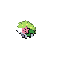

# Village bridge

| Area                                                                             | Pokemon                                                                              | &nbsp;                                                                                                | &nbsp;                                                                        | &nbsp;                                                                         | &nbsp;                                                                       | &nbsp;                                                                        |
| -------------------------------------------------------------------------------- | ------------------------------------------------------------------------------------ | ----------------------------------------------------------------------------------------------------- | ----------------------------------------------------------------------------- | ------------------------------------------------------------------------------ | ---------------------------------------------------------------------------- | ----------------------------------------------------------------------------- |
|  grass-normal           |   [Bibarel](/pokemon/400)  20%          |   [Exeggcute](/pokemon/102)  20%                       |   [Zangoose](/pokemon/335)  10% |   [Seviper](/pokemon/336)  10%    |   [Volbeat](/pokemon/313)  10%  |   [Illumise](/pokemon/314)  10% |
|                                                                                  |   [Farfetchd](/pokemon/083)  10%      |   [Chatot](/pokemon/441)  10%                             |
|  grass-doubles        |   [Flaaffy](/pokemon/180)  20%          |   [Kadabra](/pokemon/064)  20%                           |   [Lombre](/pokemon/271)  20%     |   [Nuzleaf](/pokemon/274)  20%    |   [Roselia](/pokemon/315)  10%  |   [Togepi](/pokemon/175)  10%     |
|  grass-special        |   [Chansey](/pokemon/113)  75%          |   [Emolga](/pokemon/587)  10%                             |   [Togetic](/pokemon/176)  5%    |   [Exeggutor](/pokemon/103)  5% |   [Roserade](/pokemon/407)  5% |
|  surf-normal              |   [Tentacruel](/pokemon/073)  60%    |   [Sharpedo](/pokemon/319)  40%                         |
|  surf-special           |   [Sharpedo](/pokemon/319)  60%        |   [Jellicent](/pokemon/593)  40%                       |
|  fishing-normal     |   [Carvanha](/pokemon/318)  70%        |   [Basculin-red-striped](/pokemon/550)  30% |
|  fishing-special  |   [Carvanha](/pokemon/318)  60%        |   [Basculin-red-striped](/pokemon/550)  30% |   [Sharpedo](/pokemon/319)  10% |
| legendary-encounter grass-doubles                                            |   [Shaymin-land](/pokemon/492)  1% |   [Meloetta-aria](/pokemon/648)  1%                |