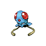

# Wellspring cave - 1f

| Area                                                                             | Pokemon                                                                                         | &nbsp;                                                                                           | &nbsp;                                                                                         | &nbsp;                                                                                             | &nbsp;                                                                                 | &nbsp;                                                                                       |
| -------------------------------------------------------------------------------- | ----------------------------------------------------------------------------------------------- | ------------------------------------------------------------------------------------------------ | ---------------------------------------------------------------------------------------------- | -------------------------------------------------------------------------------------------------- | -------------------------------------------------------------------------------------- | -------------------------------------------------------------------------------------------- |
|  cave-normal              |   [Swoobat](/blaze-black-wiki/pokemon/528)  20%    |   [Zubat](/blaze-black-wiki/pokemon/041)  20%         |   [Geodude](/blaze-black-wiki/pokemon/074)  10%   |   [Roggenrola](/blaze-black-wiki/pokemon/524)  10% |   [Aron](/blaze-black-wiki/pokemon/304)  10% |   [Whismur](/blaze-black-wiki/pokemon/293)  10% |
|                                                                                  |   [Wooper](/blaze-black-wiki/pokemon/194)  5%       |   [Bronzor](/blaze-black-wiki/pokemon/436)  5%      |   [Axew](/blaze-black-wiki/pokemon/610)  5%          |   [Teddiursa](/blaze-black-wiki/pokemon/216)  5%    |
|  cave-special           |   [Beedrill](/blaze-black-wiki/pokemon/015)  40%  |   [Diglett](/blaze-black-wiki/pokemon/050)  40%     |   [Gible](/blaze-black-wiki/pokemon/443)  20%       |
|  surf-normal              |   [Wooper](/blaze-black-wiki/pokemon/194)  60%      |   [Shellos](/blaze-black-wiki/pokemon/422)  40%     |
|  surf-special           |   [Quagsire](/blaze-black-wiki/pokemon/195)  60%  |   [Gastrodon](/blaze-black-wiki/pokemon/423)  40% |
|  fishing-normal     |   [Barboach](/blaze-black-wiki/pokemon/339)  60%  |   [Tentacool](/blaze-black-wiki/pokemon/072)  30% |   [Shellder](/blaze-black-wiki/pokemon/090)  10% |
|  fishing-special  |   [Shellder](/blaze-black-wiki/pokemon/090)  100% |